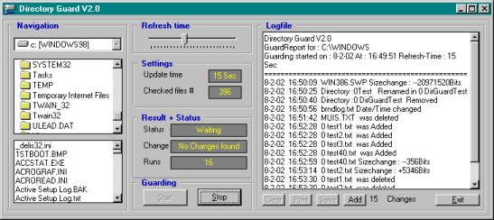



## DirGuard20

### Description

Dirguard guards a directory for changes like addig files, deletions, renaming, adding / deleting subdirectorys.

Some other small gadget have also been inserted in the code.

This is an update of previous version(s) and also the final version so i made it 2.0, i would like to spend more time on it but a new project awaits.

Please rate this code and report problems / questions or comments to me.

The code is tested on WIN-NT (4-sp6) and Win98(SE) and worked fine (WIN-NT users read the code-comment for additional information).
 
### More Info
 
Non known

             |
---                |---
**Submitted On**   |2002-02-08 17:03:58
**By**             |[Cybsoft](https://github.com/Planet-Source-Code/PSCIndex/blob/master/ByAuthor/cybsoft.md)
**Level**          |Beginner
**User Rating**    |5.0 (40 globes from 8 users)
**Compatibility**  |VB 5\.0, VB 6\.0
**Category**       |[Files/ File Controls/ Input/ Output](https://github.com/Planet-Source-Code/PSCIndex/blob/master/ByCategory/files-file-controls-input-output__1-3.md)
**World**          |[Visual Basic](https://github.com/Planet-Source-Code/PSCIndex/blob/master/ByWorld/visual-basic.md)
**Archive File**   |[DirGuard2053941282002\.zip](https://github.com/Planet-Source-Code/cybsoft-dirguard20__1-31610/archive/master.zip)

